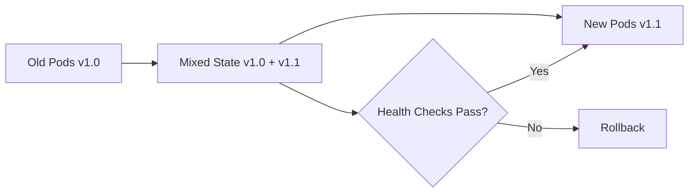

# 🔄 Kubernetes Rolling Updates - Complete Guide

## 📖 Table of Contents
- [What are Rolling Updates?](#what-are-rolling-updates)
- [How Rolling Updates Work](#how-rolling-updates-work)
- [Configuration Options](#configuration-options)
- [Monitoring Rolling Updates](#monitoring-rolling-updates)
- [Revision History Management](#revision-history-management)
- [GKE-Specific Considerations](#gke-specific-considerations)
- [Troubleshooting](#troubleshooting)
- [Production Best Practices](#production-best-practices)
- [Real-World Scenarios](#real-world-scenarios)

---

## 🎯 What are Rolling Updates?

Rolling updates allow you to update your Kubernetes deployments with **zero downtime** by gradually replacing old pods with new ones. This is the default update strategy for Deployments.

### Key Benefits:
- ✅ **Zero Downtime**: Service remains available during updates
- ✅ **Gradual Rollout**: Reduces risk of widespread failures
- ✅ **Easy Rollback**: Quick revert to previous versions
- ✅ **Health Monitoring**: Automatic failure detection and recovery

### When to Use Rolling Updates:
- Application updates and bug fixes
- Security patches
- Configuration changes
- Infrastructure updates

---

## ⚙️ How Rolling Updates Work

### Update Flow:


### Step-by-Step Process:
1. **Initiate Update**: New ReplicaSet created with updated pod template
2. **Scale Up**: New pods created according to `maxSurge` setting
3. **Health Check**: New pods must pass readiness probes
4. **Scale Down**: Old pods terminated according to `maxUnavailable` setting
5. **Repeat**: Process continues until all pods are updated
6. **Cleanup**: Old ReplicaSet scaled to 0 (but preserved for rollback)

---

## 🔧 Configuration Options

### Basic Rolling Update Configuration:
```yaml
apiVersion: apps/v1
kind: Deployment
metadata:
  name: my-app
spec:
  replicas: 5
  revisionHistoryLimit: 10  # Keep 10 revision history (default: 2)
  strategy:
    type: RollingUpdate
    rollingUpdate:
      maxSurge: 2           # Max additional pods during update
      maxUnavailable: 1     # Max unavailable pods during update
```

### Strategy Parameters:

| Parameter | Description | Values | Impact |
|-----------|-------------|---------|---------|
| `maxSurge` | Maximum pods above desired count | Integer or percentage | Higher = faster updates, more resources |
| `maxUnavailable` | Maximum unavailable pods | Integer or percentage | Lower = safer updates, slower speed |
| `revisionHistoryLimit` | Revision history to keep | Integer (default: 2) | Higher = more rollback options |

### Example Configurations:

#### Conservative (Slower, Safer):
```yaml
rollingUpdate:
  maxSurge: 1
  maxUnavailable: 0  # No downtime tolerance
```

#### Aggressive (Faster, More Resources):
```yaml
rollingUpdate:
  maxSurge: 50%
  maxUnavailable: 25%
```

#### Balanced Production:
```yaml
rollingUpdate:
  maxSurge: 25%
  maxUnavailable: 10%
```

---

## 📊 Monitoring Rolling Updates

### Essential Commands:

#### Real-Time Monitoring:
```bash
# Monitor rollout status
kubectl rollout status deployment/my-app --watch

# Watch pods in real-time
kubectl get pods -l app=my-app -w

# Monitor events
kubectl get events --watch --field-selector involvedObject.name=my-app
```

#### Status Checking:
```bash
# Check deployment status
kubectl get deployment my-app -o wide

# View rollout history
kubectl rollout history deployment/my-app

# Describe deployment details
kubectl describe deployment my-app
```

#### Advanced Monitoring:
```bash
# Monitor ReplicaSets
kubectl get replicasets -l app=my-app -o wide

# Check service endpoints
kubectl get endpoints my-service --watch

# Monitor resource usage
kubectl top pods -l app=my-app
```

### Monitoring Script:
Use our custom monitoring script for detailed tracking:
```bash
.\monitor-rollout.ps1 -DeploymentName my-app
```

### Key Metrics to Watch:

| Metric | Description | Healthy State |
|--------|-------------|---------------|
| `status.replicas` | Desired replica count | Matches spec.replicas |
| `status.updatedReplicas` | Pods with new version | Equals status.replicas |
| `status.readyReplicas` | Ready pods | Equals status.replicas |
| `status.availableReplicas` | Available pods | Equals status.replicas |

---

## 📚 Revision History Management

### Default Behavior:
- Kubernetes keeps only **2 revisions** by default
- Controlled by `spec.revisionHistoryLimit`
- Old ReplicaSets are automatically cleaned up

### Configuring Revision History:
```yaml
spec:
  revisionHistoryLimit: 10  # Keep 10 revisions
```

### Recommended Settings:
```yaml
Development:   revisionHistoryLimit: 5
Staging:       revisionHistoryLimit: 10
Production:    revisionHistoryLimit: 20
Critical Apps: revisionHistoryLimit: 50
```

### Managing Revisions:
```bash
# View revision history
kubectl rollout history deployment/my-app

# View specific revision details
kubectl rollout history deployment/my-app --revision=3

# Rollback to previous version
kubectl rollout undo deployment/my-app

# Rollback to specific revision
kubectl rollout undo deployment/my-app --to-revision=2
```

### Revision Management Script:
```bash
.\revision-manager.ps1 -DeploymentName my-app -Action show
```

---

## 🌐 GKE-Specific Considerations

### GKE Advantages:
- **Integrated Load Balancing**: Seamless integration with GCP Load Balancers
- **Node Auto-scaling**: Cluster autoscaler handles resource demands
- **Preemptible Nodes**: Cost-effective for non-critical workloads
- **Regional Persistent Disks**: High availability storage

### GKE Best Practices:

#### 1. Node Pool Strategy:
```yaml
# Use different node pools for different workload types
apiVersion: apps/v1
kind: Deployment
spec:
  template:
    spec:
      nodeSelector:
        cloud.google.com/gke-nodepool: general-purpose
      tolerations:
      - key: cloud.google.com/gke-preemptible
        operator: Equal
        value: "true"
        effect: NoSchedule
```

#### 2. Load Balancer Integration:
```yaml
apiVersion: v1
kind: Service
metadata:
  name: my-app-service
  annotations:
    cloud.google.com/neg: '{"ingress": true}'
    cloud.google.com/backend-config: '{"default": "my-backendconfig"}'
spec:
  type: LoadBalancer
  ports:
  - port: 80
    targetPort: 8080
  selector:
    app: my-app
```

#### 3. Health Check Configuration:
```yaml
# Configure proper probes for GKE load balancer health checks
containers:
- name: my-app
  livenessProbe:
    httpGet:
      path: /health
      port: 8080
    initialDelaySeconds: 30
    periodSeconds: 10
  readinessProbe:
    httpGet:
      path: /ready
      port: 8080
    initialDelaySeconds: 10
    periodSeconds: 5
```

### GKE Console Monitoring:
1. Navigate to **Kubernetes Engine > Workloads**
2. Click on your deployment
3. Monitor **Pods** tab during updates
4. Check **Events** tab for detailed logs

### Cloud Logging Queries:
```sql
-- Monitor deployment events
resource.type="k8s_cluster"
jsonPayload.kind="Deployment"
jsonPayload.metadata.name="my-app"

-- Track pod lifecycle
resource.type="k8s_pod"
labels.k8s-pod/app="my-app"
jsonPayload.reason=("Started" OR "Killing" OR "Created")
```

---

## 🚨 Troubleshooting

### Common Issues & Solutions:

#### 1. Update Stuck/Hanging
**Symptoms:**
- Rollout status shows "Waiting for deployment to finish"
- New pods stuck in `ContainerCreating` or `Pending`

**Diagnosis:**
```bash
kubectl describe pods -l app=my-app | grep -A 10 "Events:"
kubectl get events --sort-by=.metadata.creationTimestamp
kubectl describe nodes
```

**Solutions:**
```bash
# Check resource availability
kubectl describe nodes | grep -A 5 "Allocated resources"

# Force restart if stuck
kubectl rollout restart deployment/my-app

# Scale down and up
kubectl scale deployment my-app --replicas=0
kubectl scale deployment my-app --replicas=3
```

#### 2. New Pods Failing Health Checks
**Symptoms:**
- Pods in `CrashLoopBackOff` or failing readiness probes
- Rollout progressing but pods not becoming ready

**Diagnosis:**
```bash
kubectl logs -l app=my-app --previous
kubectl describe pods -l app=my-app
kubectl get events --field-selector involvedObject.name=my-app
```

**Solutions:**
```bash
# Adjust probe timing
kubectl patch deployment my-app -p '{"spec":{"template":{"spec":{"containers":[{"name":"my-app","readinessProbe":{"initialDelaySeconds":30}}]}}}}'

# Check configuration
kubectl get deployment my-app -o yaml | grep -A 10 "env:"
```

#### 3. Image Pull Issues
**Symptoms:**
- Pods stuck in `ImagePullBackOff` or `ErrImagePull`

**Diagnosis:**
```bash
kubectl describe pods -l app=my-app | grep -A 5 "Failed to pull image"
```

**Solutions:**
```bash
# Check image exists
docker pull my-image:tag

# Verify image registry access
kubectl get secrets
kubectl describe secret my-registry-secret

# Update image pull policy
kubectl patch deployment my-app -p '{"spec":{"template":{"spec":{"containers":[{"name":"my-app","imagePullPolicy":"Always"}]}}}}'
```

#### 4. Resource Constraints
**Symptoms:**
- Pods stuck in `Pending` state
- Events showing insufficient resources

**Solutions:**
```bash
# Check cluster resources
kubectl describe nodes | grep -A 5 "Allocated resources"

# Adjust resource requests
kubectl patch deployment my-app -p '{"spec":{"template":{"spec":{"containers":[{"name":"my-app","resources":{"requests":{"memory":"128Mi","cpu":"100m"}}}]}}}}'

# Scale cluster (GKE)
gcloud container clusters resize my-cluster --num-nodes=5
```

### Emergency Rollback Procedures:
```bash
# Quick rollback to previous version
kubectl rollout undo deployment/my-app

# Rollback to known good revision
kubectl rollout history deployment/my-app
kubectl rollout undo deployment/my-app --to-revision=5

# Emergency scale to zero
kubectl scale deployment my-app --replicas=0
```

---

## 🏭 Production Best Practices

### 1. Pre-Update Checklist:
- [ ] Backup current configuration
- [ ] Verify new image in staging
- [ ] Check cluster resource availability
- [ ] Ensure monitoring is active
- [ ] Plan rollback strategy

### 2. Health Check Configuration:
```yaml
containers:
- name: my-app
  # Startup probe for slow-starting containers
  startupProbe:
    httpGet:
      path: /health
      port: 8080
    failureThreshold: 30
    periodSeconds: 10
  
  # Liveness probe for runtime health
  livenessProbe:
    httpGet:
      path: /health
      port: 8080
    initialDelaySeconds: 30
    periodSeconds: 10
    timeoutSeconds: 5
    failureThreshold: 3
  
  # Readiness probe for traffic routing
  readinessProbe:
    httpGet:
      path: /ready
      port: 8080
    initialDelaySeconds: 10
    periodSeconds: 5
    timeoutSeconds: 3
    successThreshold: 1
    failureThreshold: 3
```

### 3. Graceful Shutdown:
```yaml
containers:
- name: my-app
  lifecycle:
    preStop:
      exec:
        command: ["/bin/sh", "-c", "sleep 15"]
terminationGracePeriodSeconds: 30
```

### 4. Resource Management:
```yaml
containers:
- name: my-app
  resources:
    requests:
      memory: "256Mi"
      cpu: "200m"
    limits:
      memory: "512Mi"
      cpu: "500m"
```

### 5. Anti-Affinity for High Availability:
```yaml
spec:
  template:
    spec:
      affinity:
        podAntiAffinity:
          preferredDuringSchedulingIgnoredDuringExecution:
          - weight: 100
            podAffinityTerm:
              labelSelector:
                matchExpressions:
                - key: app
                  operator: In
                  values:
                  - my-app
              topologyKey: kubernetes.io/hostname
```

---

## 🎭 Real-World Scenarios

### Scenario 1: E-commerce Application Update
**Context:** Black Friday traffic, critical uptime required

**Strategy:**
```yaml
spec:
  replicas: 20
  strategy:
    rollingUpdate:
      maxSurge: 5        # 25% additional capacity
      maxUnavailable: 2  # 10% unavailable tolerance
```

**Monitoring:**
```bash
# Monitor service availability
while true; do
  curl -s http://my-app/health > /dev/null && echo "✅ $(date)" || echo "❌ $(date)"
  sleep 1
done
```

### Scenario 2: Database Schema Migration
**Context:** Backend API with database dependencies

**Strategy:**
```yaml
# Use init containers for migration
initContainers:
- name: db-migrate
  image: my-app:migrate
  command: ["./migrate.sh"]

strategy:
  rollingUpdate:
    maxSurge: 1
    maxUnavailable: 0  # Zero downtime critical
```

### Scenario 3: Microservices Update
**Context:** Multiple interdependent services

**Strategy:**
```bash
# Coordinated rolling update
kubectl set image deployment/service-a app=service-a:v2.0 --record
kubectl rollout status deployment/service-a
kubectl set image deployment/service-b app=service-b:v2.0 --record
kubectl rollout status deployment/service-b
```

### Scenario 4: Security Patch Emergency
**Context:** Critical security vulnerability, immediate update required

**Strategy:**
```yaml
# Aggressive update for security
strategy:
  rollingUpdate:
    maxSurge: 100%     # Double capacity temporarily
    maxUnavailable: 0  # No service disruption
```

---

## 📋 Quick Reference Commands

### Update Operations:
```bash
# Update image
kubectl set image deployment/my-app container=new-image:tag --record

# Apply new configuration
kubectl apply -f deployment.yaml --record

# Patch specific fields
kubectl patch deployment my-app -p '{"spec":{"replicas":5}}'

# Rolling restart (same image)
kubectl rollout restart deployment/my-app
```

### Monitoring Operations:
```bash
# Status check
kubectl rollout status deployment/my-app

# Watch pods
kubectl get pods -l app=my-app -w

# Check history
kubectl rollout history deployment/my-app

# Detailed pod info
kubectl describe pods -l app=my-app
```

### Rollback Operations:
```bash
# Undo last deployment
kubectl rollout undo deployment/my-app

# Rollback to specific revision
kubectl rollout undo deployment/my-app --to-revision=3

# Pause/Resume rollout
kubectl rollout pause deployment/my-app
kubectl rollout resume deployment/my-app
```

### Scaling Operations:
```bash
# Manual scaling
kubectl scale deployment my-app --replicas=10

# Auto-scaling
kubectl autoscale deployment my-app --min=3 --max=10 --cpu-percent=80
```

---

## 🎯 Summary

Rolling updates are a powerful feature for maintaining application availability during updates. Key takeaways:

1. **Configure appropriately** for your environment and risk tolerance
2. **Monitor actively** during updates using multiple methods
3. **Plan for rollbacks** with adequate revision history
4. **Test thoroughly** in staging environments
5. **Use health checks** to ensure update success
6. **Consider GKE-specific features** for enhanced reliability

Remember: The goal is balancing **update speed**, **resource usage**, and **service availability** based on your specific requirements.

---

## 📁 Related Files

- [`deployment-simple.yaml`](./deployment-simple.yaml) - Basic deployment example
- [`deployment-production.yaml`](./deployment-production.yaml) - Production-ready configuration
- [`monitor-rollout.ps1`](./monitor-rollout.ps1) - Monitoring script
- [`revision-manager.ps1`](./revision-manager.ps1) - Revision management script
- [`test-rolling-update.ps1`](./test-rolling-update.ps1) - Testing script
- [`revision-commands.txt`](./revision-commands.txt) - Command reference
